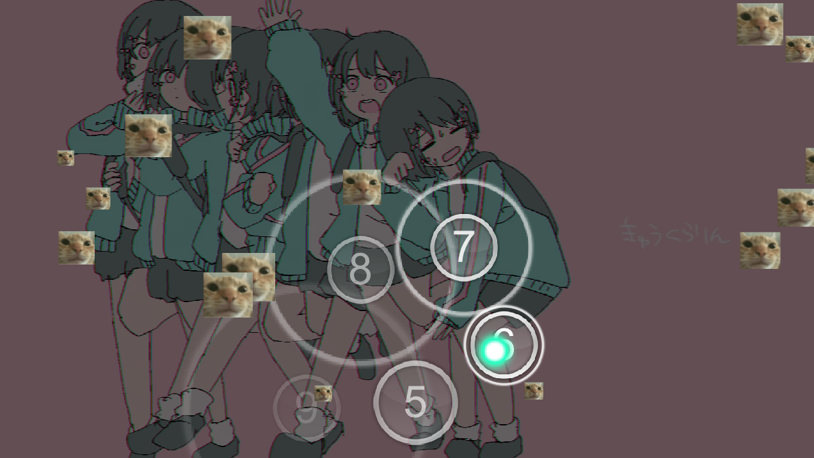
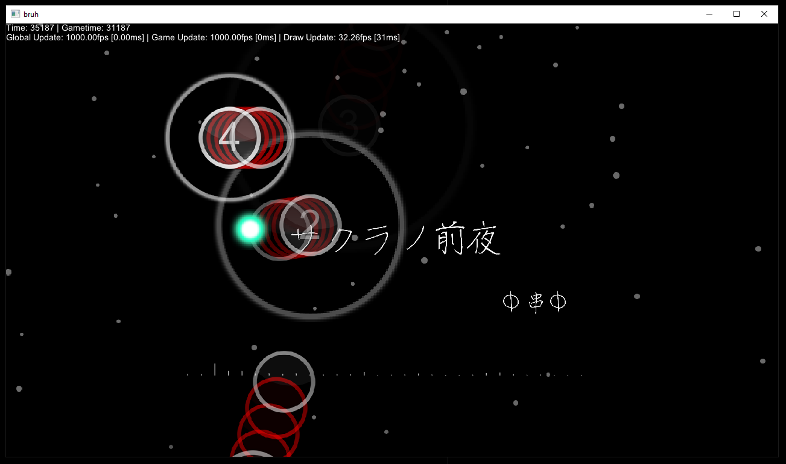
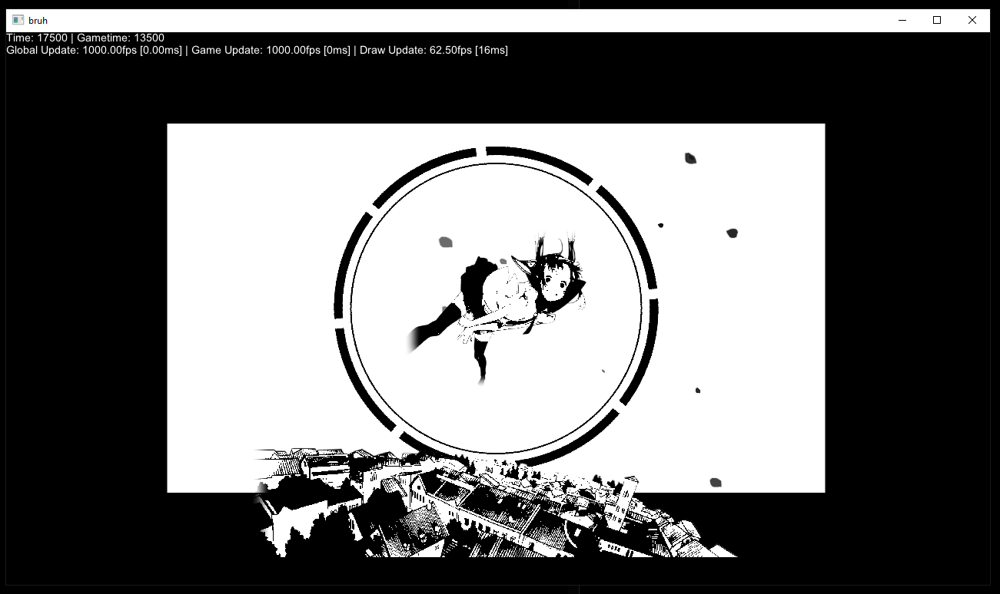
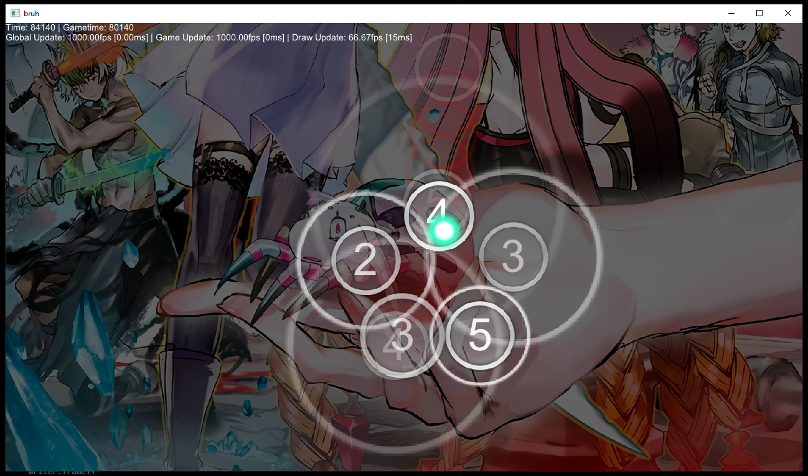
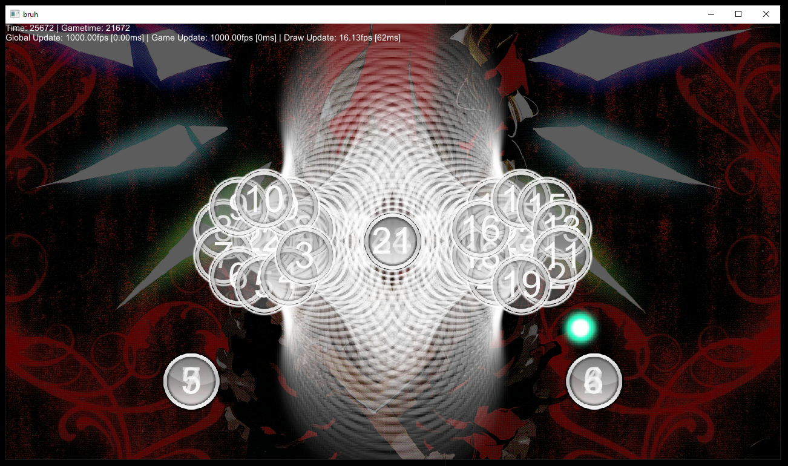

# Kurarin - barely working osu! beatmap visualizer made in V



## About

This is actually one of my first [V](https://vlang.io) project and I barely know anything about programming graphics. (lies) <br/>
Just a heads up that this program will not work 100% of the time considering I made some questionable choices while making this but hey atleast it runs (sometimes) lol.

Anyway heres some screenshots I guess.

## Screenshots

https://user-images.githubusercontent.com/44401509/143672143-24291c30-66c7-41bd-a846-c132b975d788.mp4

https://user-images.githubusercontent.com/44401509/143533114-8c228841-791d-4871-ad7f-07307cd4d56d.mp4








## How to use

I assumed you know V and have used it in the past and also have compile it. <br/>

```none
Kurarin v0.0.1
-----------------------------------------------
Usage: Kurarin [options] [ARGS]

Description: Plays an osu! beatmap!

Options:
  -b, --beatmap_file <string>
                            Path to the .osu file.
  -s, --speed <float>       Gameplay speed. (Like DT yknow, but manual)
  -t, --test                Run a test. (Lower your volume btw lol)
  -h, --help                display this help and exit
  --version                 output version information and exit
```

## Bugs

* ~~Due to some bug in v-miniaudio I had to disable hitsounds for now, it gets updated recently so ill update it sooner or later.~~ Fixed
* The entire thing is a bug and error-prone
* ~~Slider is not accurate at all since I barely put any time into it~~ Fixed but timing is still wrong sometimes
* ~~Storyboard is not accurate at all since I am stupid~~ Kinda fixed
* ~~Compiling with `-prod` fucks with the HitCircle's "logic"~~ Not anymore
* ~~Compiling with `-gc boehm` makes audio glitchy for a millisecond randomly~~ Not anymore
* And so on...

## TODOs

i got school soontm so this might not be finished at all :trollface:

* ~~Actual slider renderer lmao~~ Done
* ~~Slider curves~~
* ~~Actual osu! gameplay hitsystem and not whatever the fuck placeholder shit Im using rn~~ Partly done
* Fix timings fucking up sometimes
* Fix slider renderer alpha thingy since im doing it wrong
* Unfucked the codebase and make it stable overall [Nope]
* Replay support (kinda already there but not really, you just had to somehow give the replay event into auto listener and it should show up) [Nope]

## Credits

* [danser-go](https://github.com/Wieku/danser-go) - most of the code is based from here and osr2mp4.
* [osr2mp4-core](https://github.com/uyitroa/osr2mp4-core) - ^
* [osu!](https://osu.ppy.sh/home) - the game itself.
* [V's library](https://github.com/vlang/v/vlib) - I yoinked gg, stbi to my own lib. (thanks V contributors!)
* [v-miniaudio](https://github.com/Larpon/v-miniaudio) - yoinked to lib. (thanks larpon!)
## License

MIT
